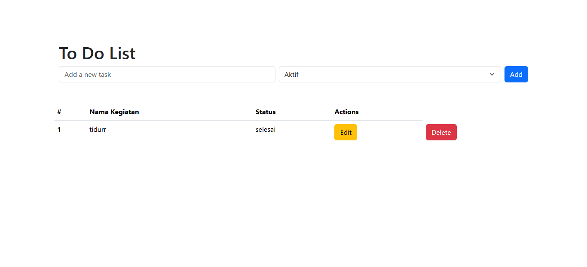
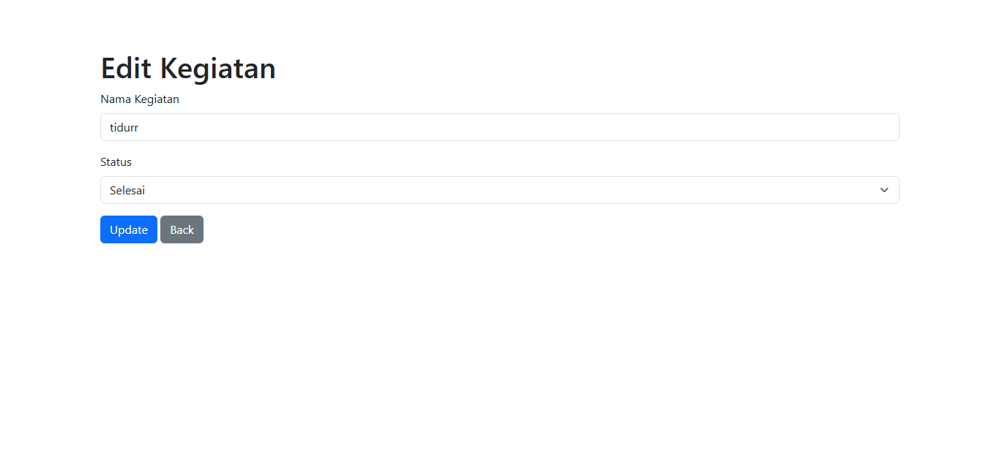

# USK LSP Test - Junior Web Programming

**Student Name:** Muhammad Ali Irfansyah

## Project Description

This is an exam project for Junior Web Programming course at USK LSP. The project implements a simple To-Do List application with CRUD (Create, Read, Update, Delete) functionality.

## Technologies Used

- Laravel (PHP Framework)
- MySQL (Database)
- Bootstrap (Frontend Styling)

## Features

- Create new to-do items
- View all to-do items
- Update existing to-do items
- Delete to-do items

## Installation

1. Clone the repository
2. Run `composer install`
3. Run `npm install`
4. Set up your database in `.env` file
5. Run `php artisan migrate`
6. Run `php artisan serve` to start the development server
7. Run `npm run dev` for frontend assets

